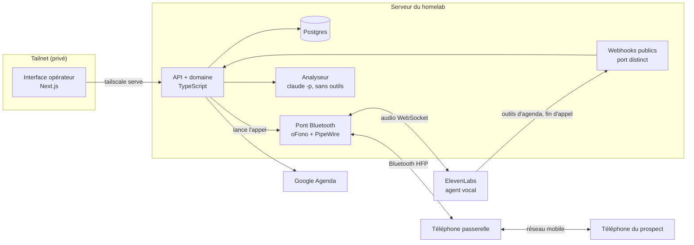

# Autocalled

Une assistante vocale IA qui passe de vrais appels de prospection sur un vrai réseau mobile, propose des créneaux lus dans Google Agenda, réserve le rendez-vous, puis rédige le bilan de chaque appel.

> **Statut : en construction.** Le vocabulaire du domaine et les décisions d'architecture sont écrits ; le cœur du domaine est développé en TDD pendant que la ligne Bluetooth attend son matériel.

## Le parcours d'un appel

1. L'opérateur choisit une **entreprise** à représenter, un **prospect** et une **version de script**.
2. Le serveur vérifie que le numéro du prospect est un **numéro autorisé**, puis fait composer l'appel à un **téléphone passerelle** appairé en Bluetooth.
3. **Mina**, l'assistante (un agent ElevenLabs), suit le script, répond aux objections de l'entreprise et s'appuie sur l'historique des appels précédents avec ce prospect. Elle parle comme une humaine, avec des réactions et des hésitations.
4. Si le prospect est intéressé, elle propose deux ou trois créneaux libres et réserve le **rendez-vous** dans un calendrier dédié.
5. À la fin de l'appel, l'audio et la transcription sont rapatriés, et un **bilan** est produit : issue, étape atteinte, objections levées ou non (chacune justifiée par une citation), points forts et points faibles.
6. L'écran d'analyse compare les versions de script d'une même entreprise, sans désigner de gagnant tant que l'échantillon est trop petit.

## Architecture

## Décisions

Chaque choix qui surprendrait un lecteur est expliqué dans un ADR :

| ADR | Décision |
|---|---|
| [0001](docs/adr/0001-demo-fermee-numeros-autorises.md) | Démo fermée : l'assistante n'appelle que des numéros autorisés, informés au préalable |
| [0002](docs/adr/0002-agenda-par-outils-webhook-maison.md) | Agenda par outils webhook maison plutôt que l'intégration Cal.com |
| [0003](docs/adr/0003-ligne-bluetooth-via-telephone-passerelle.md) | Première ligne : un téléphone passerelle en Bluetooth plutôt que Twilio |
| [0004](docs/adr/0004-heberge-sur-le-homelab.md) | Hébergé sur le homelab, pas dans le cloud |
| [0005](docs/adr/0005-bilan-par-claude-code-en-mode-headless.md) | Bilan produit par Claude Code en mode headless |
| [0006](docs/adr/0006-authentification-par-identite-tailscale.md) | Authentification par l'identité Tailscale |

Le vocabulaire du domaine (entreprise, prospect, script, objection, issue, bilan…) est défini dans [CONTEXT.md](CONTEXT.md). Le code utilise ces mots-là et pas d'autres.

## Feuille de route

Chaque étape se termine sur quelque chose qui marche de bout en bout ; le plus risqué passe en premier.

- [ ] **0. Spike Bluetooth** : le serveur fait composer le téléphone passerelle, le son passe dans les deux sens, le raccrochage est détecté.
- [ ] **1. Premier appel de Mina** : une commande lance un appel ; configuration de l'agent versionnée ; latence mesurée.
- [ ] **2. Cœur du domaine en TDD** : consentements et numéros autorisés, fiches prospect, cycle de vie d'une campagne, calcul des créneaux.
- [ ] **3. Squelette web** : Postgres, authentification Tailscale, entreprises, import des fiches prospect, appel d'un prospect.
- [ ] **4. Bilan** : audio et transcription rapatriés, analyse, écran d'un appel avec audio synchronisé.
- [ ] **5. Agenda** : Google Agenda, proposition et réservation de créneaux pendant l'appel.
- [ ] **6. Campagne en direct** : enchaînement des appels, transcription en temps réel.
- [ ] **7. Scripts versionnés et analyse** : comparaison des versions, avec garde sur la taille de l'échantillon.

## Cadre légal

Autocalled est une démo fermée : Mina n'appelle que des personnes qui ont accepté, au préalable, d'être appelées par une IA et enregistrées. C'est pour cela qu'elle ne s'annonce pas comme IA pendant l'appel. Pour démarcher de vrais prospects, ce ne serait pas permis en l'état : l'AI Act (art. 50, en vigueur depuis le 2 août 2026) impose d'informer la personne qu'elle parle à une IA, le droit français impose de la prévenir de l'enregistrement, et depuis le 11 août 2026 le démarchage téléphonique des particuliers exige leur consentement préalable. Le détail est dans l'[ADR 0001](docs/adr/0001-demo-fermee-numeros-autorises.md).

## Ce que ce dépôt ne contient pas

Aucun secret, aucun numéro de téléphone réel, aucun enregistrement ni aucune transcription d'appel. La configuration passe par des variables d'environnement, documentées dans un `.env.example` sans valeurs.
