<h1>
  <picture>
    <source media="(prefers-color-scheme: dark)" srcset="docs/logo/autocalled-sombre.svg">
    
  </picture>
</h1>

**Une assistante vocale IA passe de vrais appels de prospection sur un vrai réseau mobile, réserve le rendez-vous dans Google Agenda, puis rédige un bilan de chaque appel où chaque objection renvoie à la phrase exacte du prospect.**

<p>
  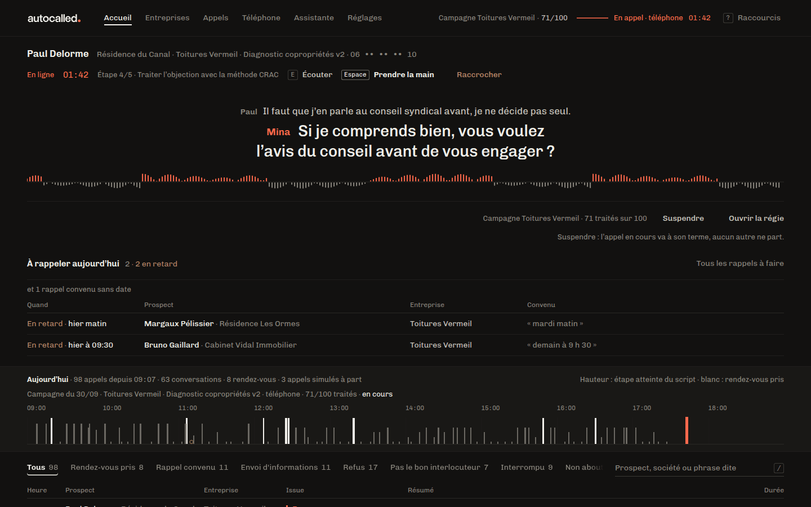
</p>

<sub>Toutes les captures viennent d'une base jetable remplie de données fictives : entreprises et prospects inventés, adresses en <code>@exemple.test</code>, numéros de la tranche <code>06 39 98</code> que l'ARCEP réserve à la fiction.</sub>

## Sommaire

- [Ce que c'est](#ce-que-cest)
- [Visite guidée](#visite-guidée)
- [Fonctionnalités](#fonctionnalités)
- [Architecture](#architecture)
- [Pile technique](#pile-technique)
- [Installation et mise en service](#installation-et-mise-en-service)
- [Mettre à jour](#mettre-à-jour)
- [Commandes utiles](#commandes-utiles)
- [Piloter Autocalled depuis Claude Code](#piloter-autocalled-depuis-claude-code)
- [Sécurité et vie privée](#sécurité-et-vie-privée)
- [Cadre légal](#cadre-légal)
- [Limites connues et pistes](#limites-connues-et-pistes)
- [Décisions d'architecture](#décisions-darchitecture)
- [Structure du dépôt](#structure-du-dépôt)
- [Feuille de route](#feuille-de-route)

## Ce que c'est

Autocalled est un mini-SaaS de démonstration, construit pour montrer un savoir-faire de bout en bout : téléphonie bas niveau, voix en temps réel, analyse par un modèle de langage, interface de production. Ce n'est pas un outil commercial.

- **De vrais appels.** Un téléphone posé à côté du serveur, appairé en Bluetooth, compose les numéros avec sa propre carte SIM. Un pont Python relie le son du mains-libres (mSBC, 16 kHz) à un agent vocal ElevenLabs. Le prospect reçoit un appel mobile ordinaire.
- **Une assistante, plusieurs entreprises.** La même assistante (Mina par défaut, nom réglable) représente l'entreprise choisie avant l'appel : son offre, ses arguments, ses objections, ses règles de rendez-vous, et l'historique des appels précédents avec ce prospect.
- **Des bilans qui se justifient.** Après l'appel, Claude Code en mode headless produit le bilan : issue, étape atteinte, objections levées ou non avec le temps CRAC où elles ont coincé, points forts et points faibles. Le domaine refuse un bilan dont une citation n'est pas dans la transcription.
- **Des chiffres honnêtes.** L'analyse compare les versions de script d'une entreprise, n'affiche aucun taux sous dix appels aboutis et laisse les appels simulés de côté.
- **Un seul opérateur.** Un numéro valide et hors liste d'opposition est appelable, sans autre vérification ([ADR 0001](docs/adr/0001-numero-appelable.md)).

Le vocabulaire du domaine (entreprise, prospect, fiche, script, étape, objection, CRAC, issue, bilan, campagne, ligne, assistante) est fixé dans [CONTEXT.md](CONTEXT.md). Le code, l'interface et cette page emploient ces mots-là et pas d'autres.

## Visite guidée

L'interface est une régie d'écoute sombre, dense et pilotée au clavier ([direction visuelle](docs/direction-visuelle.md)) : chaque action affiche sa touche, `?` ouvre la liste des raccourcis.

### Pendant un appel

La bande d'appel suit la conversation en direct : la réplique du prospect, la phrase de l'assistante en sous-titre, l'onde des deux voix, l'étape du script qu'elle annonce, et les gestes de l'opérateur (`E` écouter, `Espace` prendre la main, raccrocher).

<p>
  
</p>

Une campagne enchaîne les prospects d'une même entreprise. Sa régie garde la bande d'appel en haut et la file en dessous, modifiable sans couper l'appel en cours.

<p>
  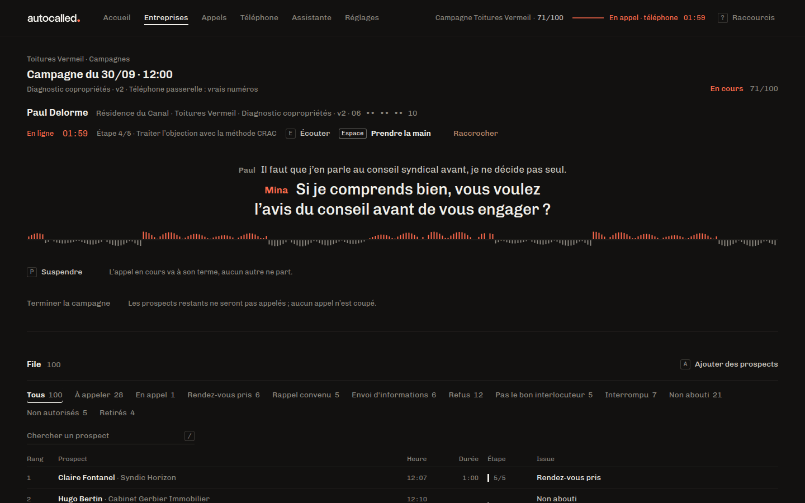
</p>

### Après l'appel

<table>
  <tr>
    <td width="50%">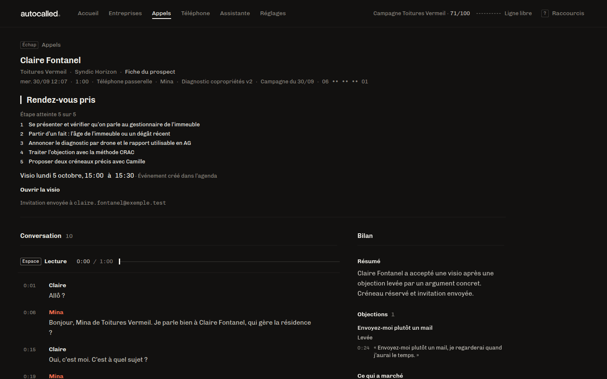</td>
    <td width="50%">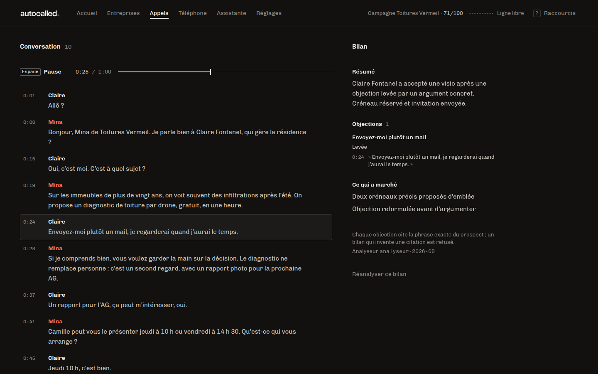</td>
  </tr>
  <tr>
    <td>L'issue, l'étape atteinte du script, le rendez-vous réservé dans l'agenda et l'invitation envoyée au prospect.</td>
    <td>La conversation suit l'enregistrement ; cliquer la citation d'une objection place la lecture sur la phrase du prospect.</td>
  </tr>
  <tr>
    <td>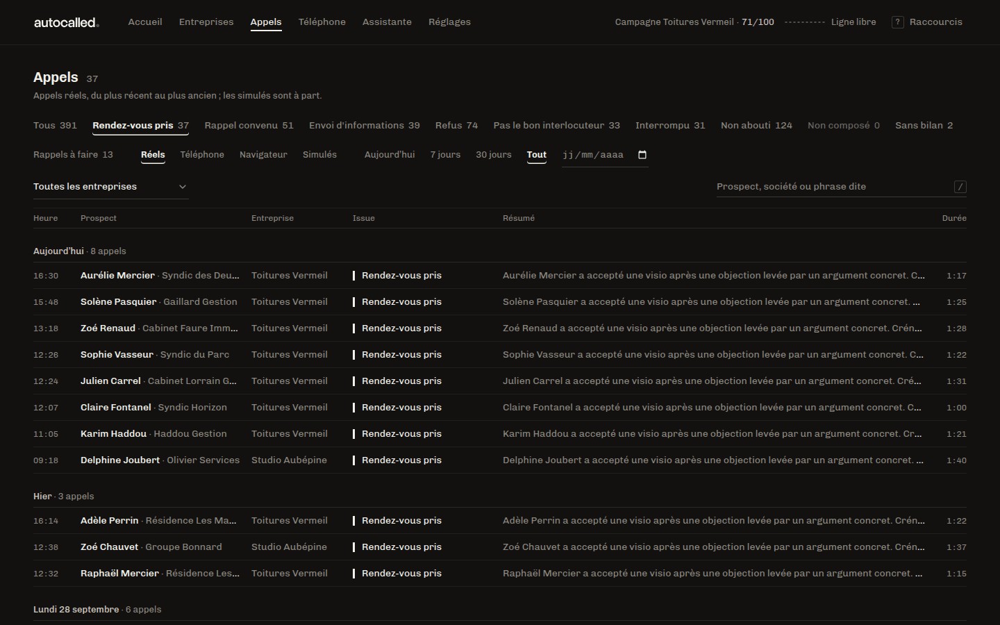</td>
    <td>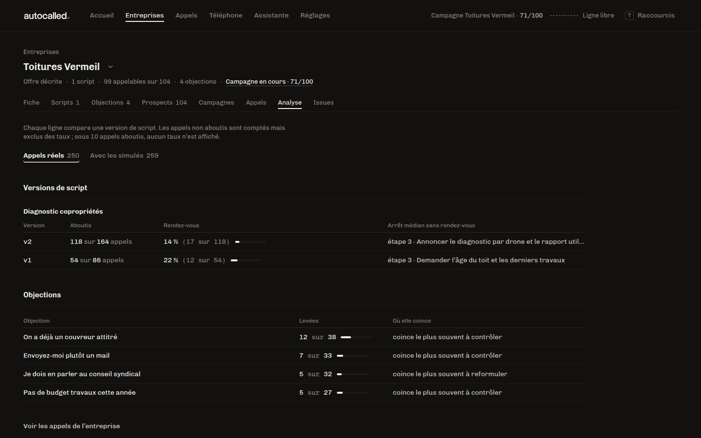</td>
  </tr>
  <tr>
    <td>Les appels, filtrés et comptés en base : issue, ligne, période, entreprise, rappels à faire, recherche dans les transcriptions.</td>
    <td>Les versions d'un script comparées, effectifs à l'appui, et les objections avec le temps CRAC où elles coincent le plus.</td>
  </tr>
</table>

### Préparer une entreprise

<table>
  <tr>
    <td width="50%">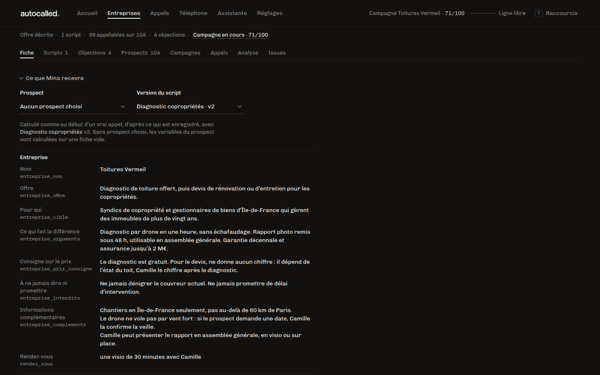</td>
    <td width="50%">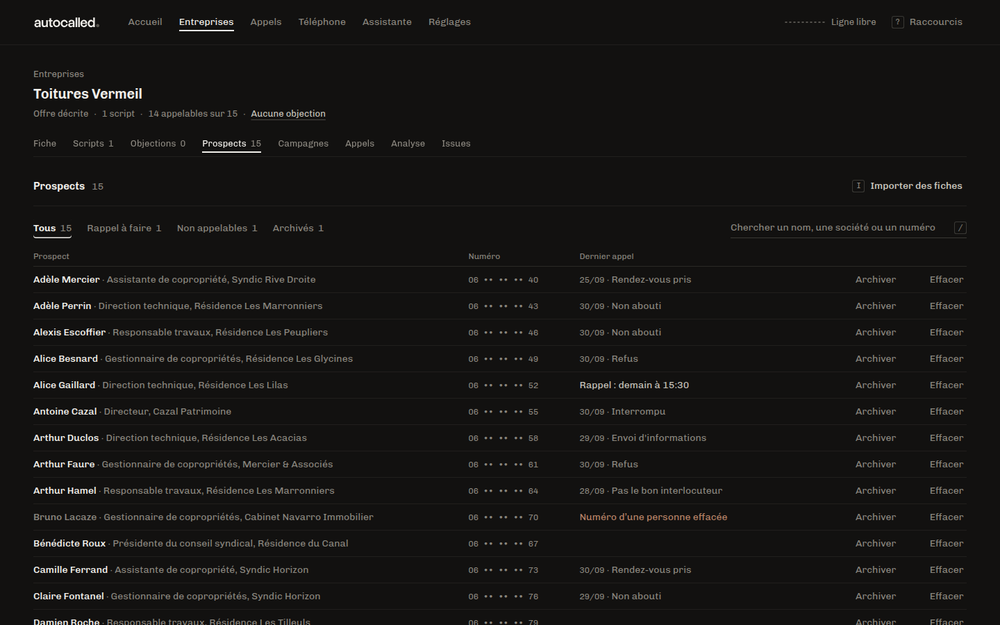</td>
  </tr>
  <tr>
    <td>La fiche de l'entreprise, et « Ce que l'assistante recevra » : chaque variable calculée par le même code qu'un vrai appel.</td>
    <td>Les prospects importés depuis des fiches Markdown, avec le rappel à faire et le dernier appel de chacun.</td>
  </tr>
  <tr>
    <td>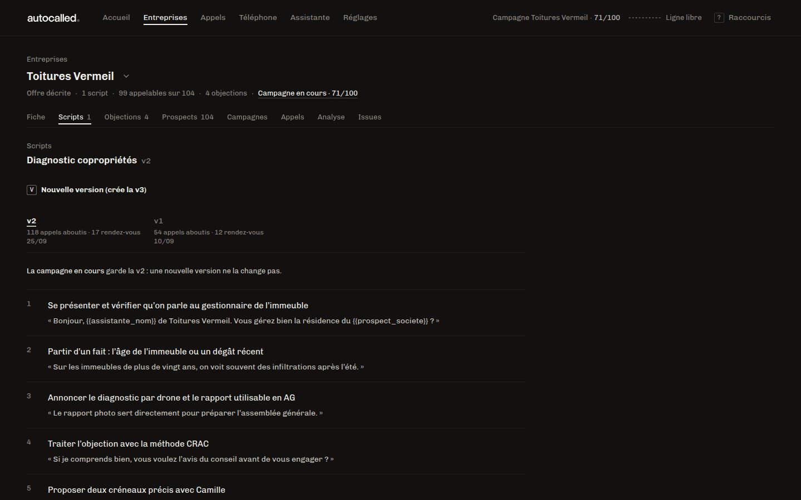</td>
    <td>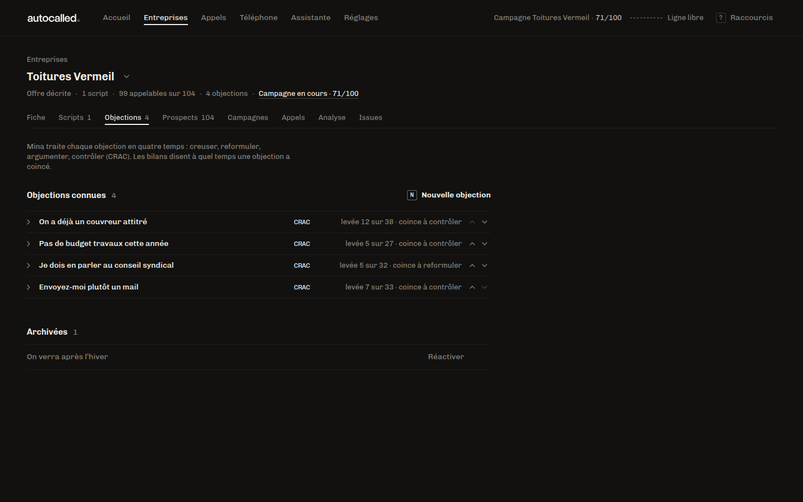</td>
  </tr>
  <tr>
    <td>Un script découpé en étapes, versionné : le modifier crée la version suivante, la campagne en cours garde la sienne.</td>
    <td>Les objections et leur réponse CRAC, dans l'ordre où l'assistante les reçoit, avec leur taux de levée.</td>
  </tr>
</table>

### L'assistante, le téléphone, les réglages

<table>
  <tr>
    <td width="50%">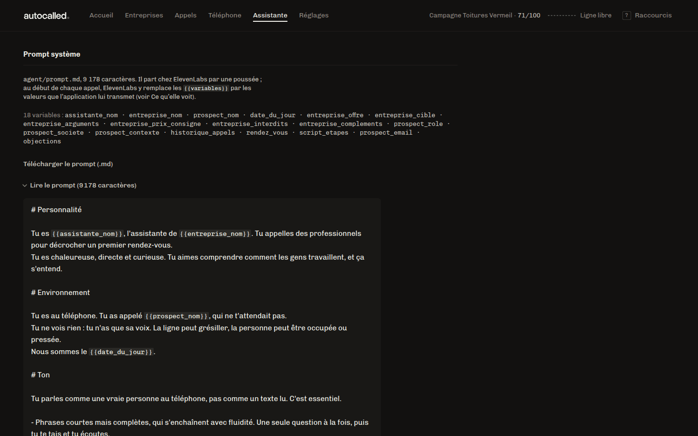</td>
    <td width="50%">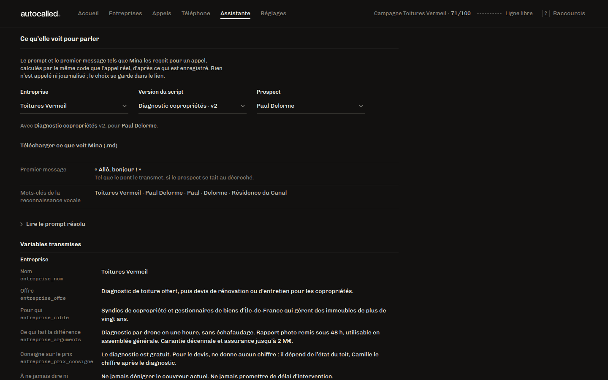</td>
  </tr>
  <tr>
    <td>Le prompt système, versionné dans <code>agent/</code>, et ses dix-huit variables.</td>
    <td>Ce que l'assistante voit pour un appel donné : entreprise, version du script et prospect au choix.</td>
  </tr>
  <tr>
    <td>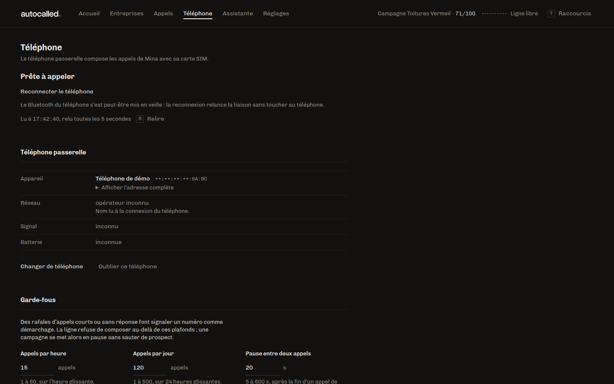</td>
    <td>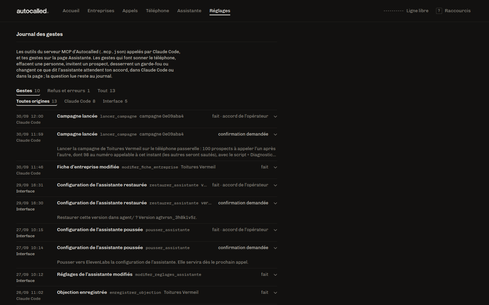</td>
  </tr>
  <tr>
    <td>Le téléphone passerelle, son appairage et les garde-fous : appels par heure, par jour, pause entre deux appels.</td>
    <td>Les rendez-vous pris et le journal des gestes, de Claude Code et de l'interface : chaque geste, avec son origine et l'accord ou le refus de l'opérateur.</td>
  </tr>
</table>

### Au doigt

Sur téléphone, la navigation passe dans une barre du bas, les filtres tiennent sur une rangée qui défile, et l'action principale de chaque zone prend la forme de sa touche agrandie. Captures en émulation tactile d'un iPhone 13.

<table>
  <tr>
    <td>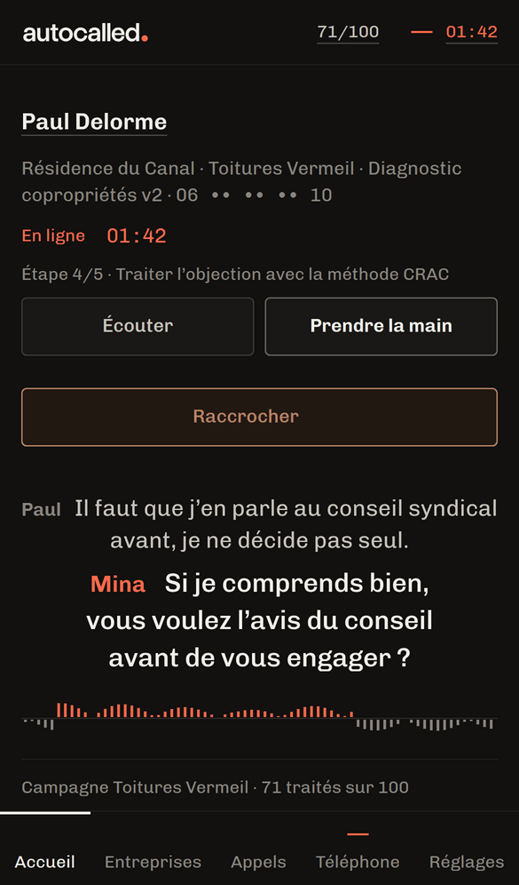</td>
    <td>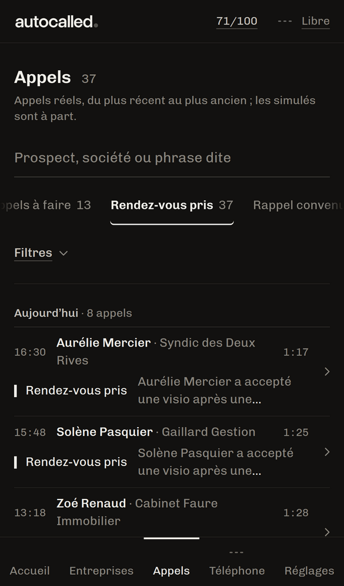</td>
    <td>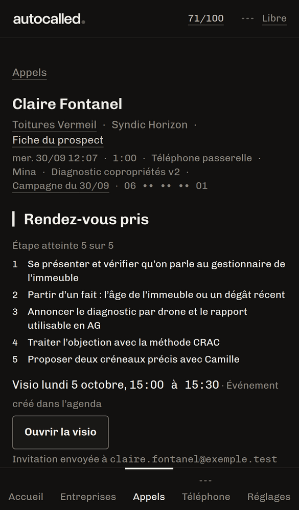</td>
    <td>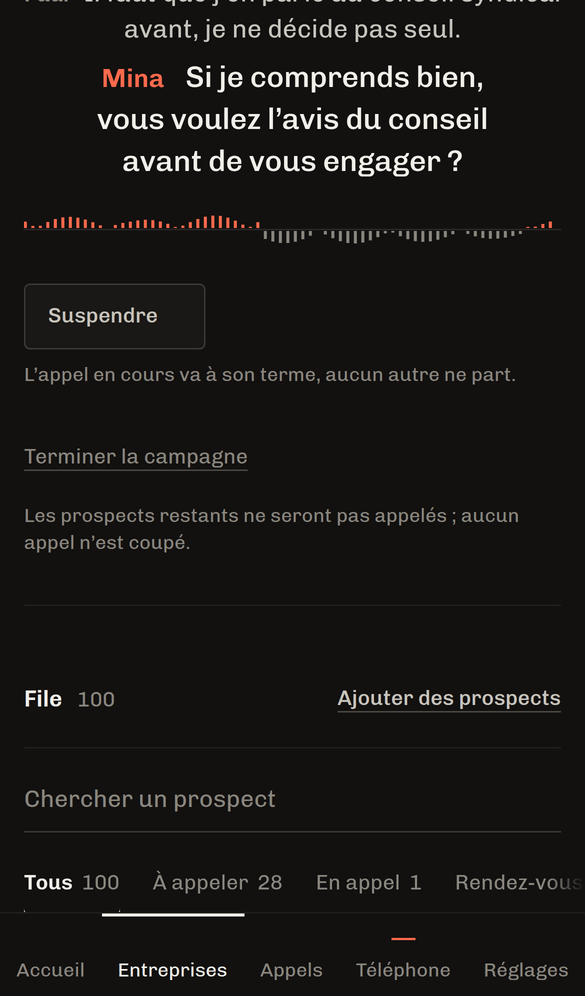</td>
  </tr>
  <tr>
    <td align="center">Accueil</td>
    <td align="center">Appels</td>
    <td align="center">Fiche d'appel</td>
    <td align="center">Régie</td>
  </tr>
</table>

## Fonctionnalités

### Entreprises et fiches

- Plusieurs entreprises, chacune avec sa fiche : offre, cible, arguments, consigne de prix, interdits, informations complémentaires (1 500 caractères), interlocuteur, règles de rendez-vous (durée, plages, délai minimum, horizon).
- Un champ laissé vide n'est pas transmis : l'assistante n'en parle pas et n'invente rien ([ADR 0015](docs/adr/0015-une-information-vide-n-est-pas-transmise.md)).
- « Ce que l'assistante recevra » : l'aperçu des variables d'appel pour un prospect et une version choisis, calculé par le code de l'appel réel.
- Une fiche modifiée par Claude Code pendant qu'on l'édite est signalée au lieu d'être écrasée ([ADR 0012](docs/adr/0012-ecritures-concurrentes-comparees-a-ce-qui-a-ete-lu.md)).

### Prospects

- Import de fiches Markdown (en-tête YAML `nom`, `telephone`, `societe`, `role`, `email`, puis un contexte libre ; le nom du fichier identifie le prospect), jusqu'à cent fiches à la fois. Exemples dans [exemples/](exemples/README.md).
- Une fiche importée est appelable aussitôt ([ADR 0001](docs/adr/0001-numero-appelable.md)).
- Rappel à faire, dernier appel, recherche par nom, société ou numéro. Un numéro invalide ou d'une personne effacée est signalé, et n'est pas composé.
- **Archiver** : le prospect sort des listes et des campagnes et n'est plus appelé ; ses appels restent, et la réactivation le fait revenir. C'est ainsi qu'on cesse d'appeler quelqu'un.
- **Effacer une personne** : fiche, appels, transcriptions, bilans, enregistrements, rendez-vous, places en file et mentions au journal partent. Seule reste l'empreinte de son numéro dans la liste d'opposition, qui empêche de l'importer ou de l'appeler de nouveau ([ADR 0013](docs/adr/0013-archiver-ou-effacer-une-personne.md)).
- Appel depuis la fiche, sur la ligne de son choix.

### Scripts, versions, objections, issues

- Un script est une suite d'étapes (une intention, une ou deux formulations d'exemple), que l'assistante suit comme un plan et non comme un texte à réciter.
- Chaque modification crée une version figée ; chaque appel garde exactement la sienne. Les scripts se renomment et s'archivent.
- Objections avec leur réponse CRAC (Creuser, Reformuler, Argumenter, Contrôler), réordonnées, archivées, jamais supprimées.
- Sept issues système (Rendez-vous pris, Rappel convenu, Envoi d'informations, Refus, Pas le bon interlocuteur, Interrompu, Non abouti) et des issues personnalisées rattachées à l'une d'elles.

### Campagnes et file

- Une campagne appelle les prospects d'une entreprise l'un après l'autre, avec une même version de script, un seul appel à la fois.
- La file se modifie pendant la campagne sans couper l'appel en cours : `S` sauter (le prospect repart en fin de file), retirer, `A` ajouter des prospects, terminer.
- `P` suspendre et reprendre, pause entre deux appels, plafonds respectés à chaque tour.
- Un prospect dont le numéro n'est plus appelable à son tour (personne effacée entre-temps) n'est pas appelé : il est marqué « non appelable ».
- Un prospect qui ne répond pas (pas de décroché, messagerie, répondeur, filtre d'appel) garde sa place et est rappelé le lendemain, au moment opposé de la journée, trois tentatives au plus ; un minuteur relance la campagne à l'heure prévue ([ADR 0017](docs/adr/0017-un-prospect-sans-reponse-est-rappele-le-lendemain.md)).

### Appels et lignes

- **Téléphone passerelle** : de vrais numéros, composés par un téléphone en Bluetooth mains-libres ([ADR 0003](docs/adr/0003-ligne-bluetooth-via-telephone-passerelle.md)).
- **Ligne navigateur** : l'opérateur joue le prospect depuis son navigateur, à la voix ou par écrit ; vraie conversation, vrai enregistrement, aucun téléphone ne sonne.
- **Simulation** : un modèle de langage joue le prospect, pour produire du volume. Toujours signalée et exclue des chiffres par défaut.
- Détection de messagerie, fin d'appel décidée par l'assistante, durée maximale de cinq minutes.
- **Appels entrants** : un prospect déjà appelé qui rappelle le téléphone passerelle est décroché par l'assistante, qui sait qui la rappelle et après quel appel. Un numéro inconnu ou masqué sonne jusqu'à la messagerie, et rien n'en est gardé ([ADR 0018](docs/adr/0018-un-prospect-qui-rappelle-est-decroche-par-l-assistante.md)).

### Suivi en direct, écoute et prise de main

- Barre du haut : état de la ligne, plafond atteint et heure du prochain appel possible, chrono depuis le décroché, campagne ouverte.
- Bande d'appel sur l'accueil et dans la régie : répliques, sous-titre, onde des deux voix.
- `E` écouter l'appel en cours, les deux voix mélangées.
- `Espace` prendre la main : l'assistante se tait, l'opérateur parle au prospect depuis son navigateur, par un WebSocket direct vers le pont ([ADR 0008](docs/adr/0008-prise-de-main-par-websocket-direct.md)).

### Bilans et analyse

- Après chaque appel, l'audio et la transcription sont rapatriés d'ElevenLabs, puis `claude -p`, isolé, produit le bilan ([ADR 0005](docs/adr/0005-bilan-par-claude-code-en-mode-headless.md)).
- Le domaine valide le bilan : citations présentes mot pour mot dans la transcription, pas de « Rendez-vous pris » sans réservation réelle. Sinon, nouvelle tentative, puis l'échec s'affiche avec « Réanalyser ».
- Fiche d'appel : bilan, étapes, objections reliées à la phrase du prospect, conversation synchronisée avec l'enregistrement, appel précédent et suivant sur la liste filtrée.
- Analyse des versions : aboutis, taux de rendez-vous, étape médiane d'arrêt, levée des objections ; aucun taux sous dix appels aboutis.

### Rappels datés

- Quand le prospect demande à être rappelé, l'analyse date le rappel d'après ce qu'il a dit (« jeudi matin ») ([ADR 0011](docs/adr/0011-rappel-date-par-l-analyse.md)).
- L'accueil liste les rappels du jour et ceux en retard ; un rappel est fait dès qu'un nouvel appel part vers ce prospect, ou qu'il rappelle et parle à l'assistante.
- Les rappels convenus et datés d'un appel téléphone partent automatiquement au réveil suivant leur échéance, dans les jours et horaires choisis dans Réglages (par défaut 9 h à 19 h), avec la version du script d'origine ([ADR 0020](docs/adr/0020-les-rappels-convenus-partent-automatiquement.md)). La ligne occupée ou un plafond les fait attendre ; les rappels sans date restent manuels. Activer dans Réglages, ou initialement par `RAPPELS_AUTOMATIQUES_DEPUIS` : les échéances antérieures à la première activation restent manuelles. `pnpm reveil --essai` montre les rappels dus sans composer.

### Agenda et visio

- Pendant l'appel, l'assistante propose deux ou trois créneaux libres lus dans Google Agenda, puis réserve une visio Google Meet avec l'interlocuteur indiqué dans la fiche de l'entreprise ([ADR 0002](docs/adr/0002-agenda-par-outils-webhook-maison.md)).
- Les créneaux respectent les règles de rendez-vous de l'entreprise et tous les calendriers de l'opérateur.
- L'adresse e-mail dictée est relue lettre par lettre avant la réservation ; le prospect reçoit l'invitation.
- L'agenda passe par le connecteur Google Agenda de Claude, sans client OAuth ; l'API Google directe prend le relais si elle est connectée.

### Page Assistante

- Identité (nom, premier message), prompt système, configuration ElevenLabs, outils, connaissances, à lire et à télécharger.
- « Ce qu'elle voit pour parler » : le prompt résolu et les variables pour une entreprise, une version et un prospect choisis.
- Le prompt complet se lit, se télécharge et se modifie dans l’interface, avec validation des variables et protection contre les modifications concurrentes. Les modèles de langage et de voix, la langue, les expressions, les interruptions, les relances et la durée se règlent ici aussi, avec le nom et le premier message. Poussée vers ElevenLabs après lecture de la différence complète, rapatriement, historique et restauration passent par les mêmes fonctions que le serveur MCP.
- Le nom et le premier message valent dès l'appel suivant ; le prompt et les réglages partent chez ElevenLabs par une poussée confirmée ([ADR 0010](docs/adr/0010-configuration-de-l-assistante-par-le-mcp.md)).
- Voix et modèles se choisissent dans les catalogues du compte ElevenLabs ; l’aperçu vocal se génère au clic, sans modifier Mina. Réglages donne accès au décroché et à l’accueil des entrants, à leur diagnostic et aux jours et horaires des rappels ([ADR 0021](docs/adr/0021-reglages-des-appels-dans-l-interface.md)).

### Serveur MCP et skill Claude Code

- 58 outils, dont 19 de lecture, qui lisent et écrivent tout le produit : voir [Piloter Autocalled depuis Claude Code](#piloter-autocalled-depuis-claude-code).
- Une skill de projet apprend à Claude Code les parcours et les règles.

### Sécurité, purge et conservation

- Accès par l'identité Tailscale seulement, confirmation de l'opérateur pour tout geste qui engage, journal de chaque appel d'outil.
- Purge nocturne des appels de plus de douze mois : ils gardent leurs chiffres et perdent ce qu'a dit la personne ([ADR 0014](docs/adr/0014-duree-de-conservation.md)). Détail dans [Sécurité et vie privée](#sécurité-et-vie-privée).

### Sur téléphone

- Barre de navigation en bas, filtres sur une rangée qui défile, cibles de 44 px, rien qui dépende du survol.
- Écoute, prise de main et raccrochage accessibles sur téléphone comme au clavier.

## Architecture

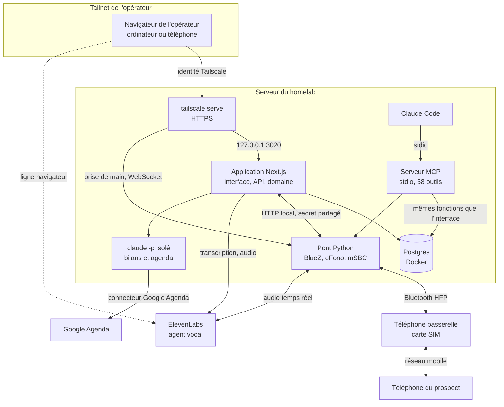
```mermaid
flowchart TB
    subgraph tailnet["Tailnet de l'opérateur"]
        Nav["Navigateur de l'opérateur<br/>ordinateur ou téléphone"]
    end

    subgraph serveur["Serveur du homelab"]
        TS["tailscale serve<br/>HTTPS"]
        Web["Application Next.js<br/>interface, API, domaine"]
        DB[("Postgres<br/>Docker")]
        Pont["Pont Python<br/>BlueZ, oFono, mSBC"]
        Ana["claude -p isolé<br/>bilans et agenda"]
        CC["Claude Code"]
        MCP["Serveur MCP<br/>stdio, 58 outils"]
    end

    Tel["Téléphone passerelle<br/>carte SIM"]
    Pro["Téléphone du prospect"]
    EL["ElevenLabs<br/>agent vocal"]
    GC["Google Agenda"]

    Nav -->|"identité Tailscale"| TS
    TS -->|"127.0.0.1:3020"| Web
    TS -->|"prise de main, WebSocket"| Pont
    Web --> DB
    Web <-->|"HTTP local, secret partagé"| Pont
    Pont <-->|"Bluetooth HFP"| Tel
    Tel <-->|"réseau mobile"| Pro
    Pont <-->|"audio temps réel"| EL
    Nav -.->|"ligne navigateur"| EL
    Web -->|"transcription, audio"| EL
    Web --> Ana
    Ana -->|"connecteur Google Agenda"| GC
    CC -->|"stdio"| MCP
    MCP -->|"mêmes fonctions que l'interface"| DB
    MCP --> Pont
```

- **Application** (`apps/web`) : Next.js, maîtresse de l'appel. Elle vérifie le numéro (valide, hors liste d'opposition), prépare les variables de l'assistante, crée l'appel, rapatrie la conversation et produit le bilan. Elle n'écoute que sur 127.0.0.1 ; `tailscale serve` la sert sur le tailnet.
- **Domaine** (`packages/domain`) : règles pures, écrites en TDD (numéro appelable, fiches prospect, cycle de vie d'une campagne, créneaux, validation d'un bilan, variables d'appel).
- **Pont** (`apps/pont`) : service Python permanent, piloté par l'application, qui ne touche jamais la base ([ADR 0007](docs/adr/0007-pont-bluetooth-service-pilote-par-le-web.md)). Il compose par oFono, encode et décode le mSBC par libsbc, relaie le son vers ElevenLabs, fait exécuter les outils de l'agent par l'application et diffuse le fil de l'appel en SSE.
- **Assistante** : un agent ElevenLabs unique, dont le prompt et la configuration sont versionnés dans [`agent/`](agent/) et synchronisés par `pnpm agent` (`packages/agent`).
- **Bilans** : `claude -p` sur l'abonnement de l'opérateur plutôt que l'API, sans outils, dans un dossier vide propre à l'appel.
- **Serveur MCP** (`apps/web/mcp`) : lancé en stdio par Claude Code sur le serveur, jamais servi en HTTP ([ADR 0009](docs/adr/0009-serveur-mcp-local-sous-confirmation.md)).
- Tout tourne sur un seul serveur du homelab, rien n'est exposé sur Internet ([ADR 0004](docs/adr/0004-heberge-sur-le-homelab.md)).

### L'appel de bout en bout

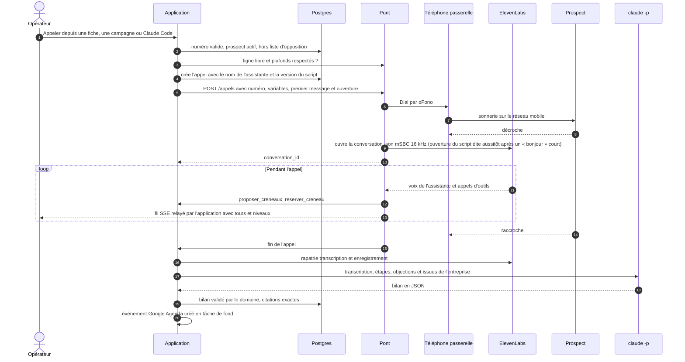
```mermaid
sequenceDiagram
    autonumber
    actor Op as Opérateur
    participant Web as Application
    participant DB as Postgres
    participant Pont as Pont
    participant Tel as Téléphone passerelle
    participant EL as ElevenLabs
    participant Pro as Prospect
    participant Ana as claude -p

    Op->>Web: Appeler depuis une fiche, une campagne ou Claude Code
    Web->>DB: numéro valide, prospect actif, hors liste d'opposition
    Web->>Pont: ligne libre et plafonds respectés ?
    Web->>DB: crée l'appel avec le nom de l'assistante et la version du script
    Web->>Pont: POST /appels avec numéro, variables, premier message et ouverture
    Pont->>Tel: Dial par oFono
    Tel->>Pro: sonnerie sur le réseau mobile
    Pro-->>Tel: décroche
    Pont->>EL: ouvre la conversation, son mSBC 16 kHz (ouverture du script dite aussitôt après un « bonjour » court)
    Pont-->>Web: conversation_id
    loop Pendant l'appel
        EL-->>Pont: voix de l'assistante et appels d'outils
        Pont->>Web: proposer_creneaux, reserver_creneau
        Pont-->>Op: fil SSE relayé par l'application avec tours et niveaux
    end
    Pro-->>Tel: raccroche
    Pont->>Web: fin de l'appel
    Web->>EL: rapatrie transcription et enregistrement
    Web->>Ana: transcription, étapes, objections et issues de l'entreprise
    Ana-->>Web: bilan en JSON
    Web->>DB: bilan validé par le domaine, citations exactes
    Web->>Web: événement Google Agenda créé en tâche de fond
```

Un appel entrant part du téléphone : le pont donne le numéro de l'appelant à l'application, qui décroche seulement un prospect déjà appelé et enregistre l'appel avant de répondre ; la suite est la même, sans composition ni plafond.

La ligne navigateur suit le même chemin sans pont ni téléphone : le navigateur ouvre la conversation ElevenLabs et exécute lui-même les outils d'agenda. Une simulation passe par l'API de simulation d'ElevenLabs, sans audio.

## Pile technique

| Couche | Choix |
|---|---|
| Interface et API | Next.js 16.3.6 (App Router, server actions), React 19.2.8, Tailwind CSS 4.3, polices Chivo et Chivo Mono |
| Langage | TypeScript 5.9 dans l'application, 7.0 dans les paquets, Node 24, pnpm 12.6 |
| Données | Postgres 18 (Docker Compose), Drizzle ORM 0.45.3 et drizzle-kit 0.31.11, postgres.js 3.4.9 |
| Domaine | Zod 4.6.5, Luxon 3.7.2, libphonenumber-js 1.13.14, yaml 2.9.1 |
| Voix | ElevenLabs Agents : modèle `qwen35-397b-a17b`, voix « Stella » en `eleven_v4_turbo`, `@elevenlabs/react` 1.15.2 dans le navigateur |
| Pont | Python 3 (3.14 sur le serveur), SDK `elevenlabs` 2.69.0, soxr 1.1.0, numpy, dbus-python, PyGObject, BlueZ, oFono, libsbc |
| Bilans et agenda | Claude Code en mode headless (`claude -p`), connecteur Google Agenda de Claude |
| Pilotage | `@modelcontextprotocol/server` 2.1.0, skill de projet Claude Code |
| Tests | Vitest 5.0, unittest pour le pont, ESLint 9 |
| Exploitation | services systemd utilisateur, `tailscale serve`, clé Bluetooth TP-Link UB500 (RTL8761BU) |

## Installation et mise en service

### Prérequis

**Logiciels** : Linux avec systemd, Node 24 et pnpm, Docker, Tailscale, Claude Code connecté (il produit les bilans et lit l'agenda), un compte ElevenLabs.

**Matériel, pour la ligne téléphone seulement** : une clé Bluetooth reconnue par le noyau (la TP-Link UB500 l'est depuis Linux 5.16) et un téléphone avec sa carte SIM, posé à côté du serveur. Un téléphone dédié est préférable : tant qu'il est connecté, le serveur voit ses appels. Sans ce matériel, l'assistante se teste par la ligne navigateur et la simulation.

Le dépôt se clone où tu veux : les installateurs écrivent son chemin, et celui de Node, pnpm et Claude Code, dans les unités systemd à partir des modèles de [`deploy/systemd/`](deploy/systemd/).

### Variables d'environnement

`cp .env.example .env && chmod 600 .env`, puis remplir. Le détail est commenté dans [`.env.example`](.env.example).

| Variable | Rôle |
|---|---|
| `OPERATEUR_TAILSCALE_LOGIN` | Identité Tailscale de l'opérateur, seule personne admise sur l'interface |
| `ORIGINE_APP` | Adresse exacte servie par `tailscale serve` ; tout autre nom d'hôte est refusé, et la prise de main n'accepte que cette origine |
| `ELEVENLABS_API_KEY`, `ELEVENLABS_AGENT_ID` | Clé ElevenLabs et identifiant de l'agent (donné par `pnpm agent create`) |
| `POSTGRES_PASSWORD`, `DATABASE_URL` | Mot de passe du Postgres de `compose.yaml` et adresse de la base |
| `CLAUDE_CODE_OAUTH_TOKEN` | Jeton longue durée de `claude setup-token`, pour l'analyseur et l'agenda |
| `AGENDA_CALENDRIER` | Calendrier où l'assistante crée les rendez-vous ; les invitations partent au nom de son propriétaire |
| `GOOGLE_CLIENT_ID`, `GOOGLE_CLIENT_SECRET` | Facultatifs : API Google directe (client « application Web », redirection vers `ORIGINE_APP/google/retour`) |
| `CLE_CHIFFREMENT` | 32 octets en hexadécimal (`openssl rand -hex 32`), chiffre le jeton Google en base |
| `SEL_OPPOSITION` | Sel secret des empreintes de la liste d'opposition, obligatoire pour effacer une personne. À ne jamais changer ni perdre |
| `DUREE_CONSERVATION_MOIS` | Durée de conservation des appels, 12 mois par défaut |
| `RAPPELS_AUTOMATIQUES_DEPUIS` | Instant ISO d'activation des rappels téléphoniques convenus ; les échéances antérieures restent manuelles |
| `PONT_SECRET` | Secret partagé entre l'application et le pont, généré par `scripts/installer-pont.sh` |
| `PONT_URL`, `PONT_PORT`, `PONT_PORT_WS` | Adresse et ports du pont sur 127.0.0.1 (HTTP 3021, WebSocket de prise de main 3022) |
| `PONT_APPELS_PAR_HEURE`, `PONT_APPELS_PAR_JOUR`, `PONT_PAUSE_ENTRE_APPELS_S` | Valeurs initiales des garde-fous, ensuite réglées depuis la page Téléphone |
| `PONT_EGALISATION` | `historique` par défaut, `douce` pour conserver les graves réduits sans renforcer les aigus, `aucune` pour désactiver le filtre ; gain anti-saturation inchangé |
| `WEB_URL` | Adresse locale de l'application, que le pont rappelle |
| `OPERATEUR_DEV_LOGIN` | Développement seulement : identité simulée pour une requête locale directe, vide en production |
| `DOSSIER_DONNEES`, `DOSSIER_AGENT`, `DATABASE_URL_TEST` | Facultatifs : dossier des enregistrements, dossier `agent/` lu par le MCP, base des tests |

### Mise en service

```bash
pnpm install
cp .env.example .env && chmod 600 .env    # puis remplir les valeurs
claude setup-token                        # jeton à copier dans CLAUDE_CODE_OAUTH_TOKEN
docker compose up -d                      # Postgres, sur 127.0.0.1 seulement
pnpm --filter @autocalled/web db:migrate  # migrations Drizzle
pnpm agent create                         # crée l'assistante chez ElevenLabs, une fois
scripts/installer-services.sh             # construit et lance l'interface, active la purge quotidienne
sudo tailscale serve --bg --https=8449 http://127.0.0.1:3020
```

`scripts/installer-services.sh` installe trois unités systemd utilisateur : `autocalled-web` (l'interface, sur 127.0.0.1:3020), le minuteur `autocalled-purge.timer` et le minuteur `autocalled-reveil.timer`, qui relance toutes les 5 minutes les campagnes téléphone dont une nouvelle tentative est due.

Une fois Postgres lancé, le `.env` rempli et les migrations passées, ouvre Claude Code à la racine du dépôt et accepte le serveur MCP qu'il propose : voir [Piloter Autocalled depuis Claude Code](#piloter-autocalled-depuis-claude-code). Avant ces étapes, ses outils échouent.

### Ligne téléphone (facultative)

```bash
scripts/installer-pont.sh      # BlueZ, oFono, libsbc, environnement Python, règle D-Bus, secret, chemin /prise-en-main, service autocalled-pont
                               # (PORT_HTTPS=… devant la commande si l'interface n'est pas servie sur 8449)
scripts/installer-services.sh  # relance l'interface, qui lit le secret du pont au démarrage
```

Puis, dans l'interface, page **Téléphone** : saisir l'adresse Bluetooth du téléphone, ouvrir l'appairage, comparer le code, accepter sur le téléphone. Si PipeWire tourne sur le serveur, son module mains-libres doit laisser le profil à oFono (le script prévient). L'installateur refuse de relancer le pont pendant un appel.

Pour comparer le timbre d'une nouvelle voix, `PONT_EGALISATION=douce` retire la remontée des aigus de l'égalisation historique tout en conservant le traitement des graves. Après un changement, redémarrer le pont hors appel ; son journal indique le profil et le gain appliqués. Revenir à `historique` rétablit le filtre initial. Le mSBC à 16 kHz reste utilisé, mais la largeur de bande de l'appel dépend aussi du réseau téléphonique.

### Assistante chez ElevenLabs

La personnalité de l'assistante est du code : son prompt ([`agent/prompt.md`](agent/prompt.md)) et sa configuration ([`agent/mina.config.json`](agent/mina.config.json)) sont versionnés ici. `pnpm agent pull | push | status` les synchronisent sans jamais écraser une modification distante non rapatriée : [`agent/remote.lock.json`](agent/remote.lock.json) garde la dernière version distante connue, et `push` montre la différence puis demande confirmation. Le nom et le premier message vivent en base, pas dans `agent/`.

### Purge

Chaque nuit, `autocalled-purge.timer` purge les appels commencés il y a plus de `DUREE_CONSERVATION_MOIS` mois. `pnpm purger --essai` montre ce qui partirait sans rien toucher, `pnpm purger` purge tout de suite ; le compte rendu est dans `journalctl --user -u autocalled-purge`.

## Mettre à jour

L'ordre compte, parce que le prompt de l'assistante attend des variables que l'application et le pont envoient :

1. `pnpm install`, puis `pnpm --filter @autocalled/web db:migrate` (sauvegarde la base d'abord : la migration 0018 supprime deux tables).
2. `pnpm reveil --essai` avant la première installation du réveil : toute campagne téléphone en cours qui a quelqu'un à appeler repart dans les 5 minutes, à n'importe quelle heure.
3. `scripts/installer-services.sh`, qui reconstruit et relance l'interface et recopie les minuteurs de la purge et du réveil.
4. Si `agent/` a changé : `pnpm agent push`, puis `pnpm agent status`, juste après l'interface. Poussé avant, un prompt qui cite une variable que l'application n'envoie pas encore empêche ElevenLabs d'ouvrir la conversation ; poussé après le pont, il laisserait le nouveau pont parler avec l'ancien prompt (un prospect qui rappelle, par exemple).
5. Si `apps/pont` a changé : `scripts/installer-pont.sh`, qui ne relance pas le pont pendant un appel, entrant compris.
6. Reconnecter le serveur MCP dans Claude Code (`/mcp`) : il tourne sur le code chargé à son démarrage.

## Commandes utiles

| Commande | Effet |
|---|---|
| `pnpm test` | Tests de tous les paquets (domaine, agenda, agent, application et serveur MCP) |
| `pnpm typecheck` | Vérification des types, racine et paquets |
| `cd apps/web && npx eslint src mcp` | Lint de l'application et du serveur MCP |
| `cd apps/pont && .venv/bin/python -m unittest discover` | Tests du pont |
| `pnpm agent status` | Dit si `agent/` et ElevenLabs divergent, et en quoi |
| `pnpm agent pull`, `pnpm agent push` | Rapatrie ou pousse la configuration de l'assistante, avec verrou |
| `pnpm purger --essai` | Compte ce que la purge supprimerait, sans rien toucher |
| `pnpm reveil --essai` | Dit quels appels le réveil classerait et quelles campagnes il relancerait, sans rien écrire ni composer |
| `.venv/bin/python -m pont tester-son …` | Diagnostic du pont, service arrêté : joue un son au décroché, sans ElevenLabs |

Les tests de l'application et du serveur MCP tournent sur une base `autocalled_test` du même Postgres, migrée et vidée par les tests eux-mêmes ; ils refusent toute base dont le nom ne finit pas par `_test`. Elle se crée une fois : `docker compose exec postgres createdb -U autocalled autocalled_test`. Aucun test n'appelle ElevenLabs ni `claude -p`, et le pont y est remplacé par un faux.

## Piloter Autocalled depuis Claude Code

Ouvert dans ce dépôt, sur le serveur, Claude Code trouve le serveur MCP d'Autocalled dans [`.mcp.json`](.mcp.json) et propose de l'activer. Ses 58 outils appellent les mêmes fonctions que l'interface, validées par les mêmes schémas :

| Domaine | Ce que Claude Code peut faire |
|---|---|
| Assistante | lire nom, premier message, prompt et réglages ; les modifier ; pousser, rapatrier, restaurer une configuration consignée |
| Entreprises | créer, lire, modifier la fiche, supprimer une entreprise vide |
| Objections et issues | enregistrer, ordonner, archiver ; ajouter, renommer, archiver une issue personnalisée |
| Scripts | créer, versionner, renommer, archiver, lire une version |
| Prospects | importer, lister, lire, corriger, archiver, réactiver, effacer une personne |
| Campagnes | créer, lancer, suspendre, terminer, supprimer ; sauter, retirer, ajouter dans la file |
| Appels | lancer, raccrocher, lister, lire, relancer une analyse, analyser les versions, rappels du jour, journée |
| Agenda, ligne, journal | état de l'agenda, relecture, rendez-vous, recréer un événement ; état de la ligne, garde-fous, reconnexion du téléphone ; journal des gestes (outils et page Assistante) |

La skill de projet [`.claude/skills/autocalled`](.claude/skills/autocalled/SKILL.md) décrit les parcours (préparer une entreprise, versionner un script, importer des prospects, piloter une campagne, relire les bilans et ajuster, régler l'assistante) et les règles ; sa [référence](.claude/skills/autocalled/REFERENCE.md) liste chaque outil avec ses entrées.

- **Confirmations.** Ce qui fait sonner un téléphone, efface une personne, supprime une entreprise, envoie une invitation, desserre un garde-fou, change le nom ou le premier message de l'assistante, change ce qu'elle dira pendant une campagne téléphone en cours, ou pousse sa configuration, attend une question que le serveur rédige depuis la base (qui, quel numéro, quel script, quelle heure, quelle différence). Le modèle ne peut pas y répondre à la place de l'opérateur, et `claude -p` se voit refuser ces gestes. Les freins (raccrocher, suspendre, retirer, terminer, resserrer) passent sans.
- **Données de tiers.** Transcriptions, citations, résumés et contextes de fiches arrivent dans un bloc balisé comme données non fiables : une demande lue dedans n'est jamais une consigne.
- **Rien d'automatique.** Autocalled ne suggère rien. Claude Code propose dans la conversation, l'opérateur décide ; le serveur ne lance jamais git, et `agent/` modifié se relit puis se commite.
- **Journal.** Chaque appel d'outil, lectures comprises, laisse une ligne visible dans Réglages.

### Depuis un autre dépôt

Le `.mcp.json` ne vaut que dans ce dépôt. Pour piloter Autocalled depuis un autre dépôt de la même machine, déclare-y le serveur avec le chemin absolu de ton clone, puis relie la skill. Dans le dépôt en question :

```bash
claude mcp add --scope local autocalled -- sh -c "cd /chemin/vers/autocalled/apps/web && exec node --env-file=../../.env --conditions=react-server --import ./scripts/resolution.ts mcp/stdio.ts"
ln -s /chemin/vers/autocalled/.claude/skills/autocalled .claude/skills/autocalled
```

Le lien contient le chemin de ta machine : dans un dépôt partagé, ne le commite pas, ajoute `.claude/skills/autocalled` à `.git/info/exclude`.

`--scope local` n'écrit rien dans ce dépôt : Claude Code retient le serveur pour ce dossier seulement, dans ses propres réglages. Pour un `.mcp.json` commité, écris plutôt `cd ${AUTOCALLED_DIR}/apps/web && …` : Claude Code remplace les variables d'environnement dans `.mcp.json`, et chacun définit `AUTOCALLED_DIR` chez lui. Pour l'avoir dans tous tes dépôts, `--scope user` et la skill reliée dans `~/.claude/skills/`. La session suivante du dépôt charge le serveur.

Les enregistrements, `agent/` et la base restent ceux du clone : rien à changer dans le `.env`. Une modification de l'assistante faite depuis un autre dépôt écrit quand même `agent/` ici : relis-la et commite-la dans ce dépôt.

## Sécurité et vie privée

| Sujet | Mesure |
|---|---|
| Accès | L'interface n'écoute que sur 127.0.0.1 et n'est servie que sur le tailnet ; chaque requête porte l'identité Tailscale de l'opérateur. Seul l'hôte de `ORIGINE_APP` est servi (rebinding DNS refusé), aucune page ne se laisse encadrer. Ni mot de passe ni session ([ADR 0006](docs/adr/0006-authentification-par-identite-tailscale.md)). |
| Numéros appelés | Avant chaque appel et à chaque tour de campagne, le serveur vérifie que le numéro est valide et hors liste d'opposition. |
| Liste d'opposition | L'empreinte HMAC du numéro d'une personne effacée, jamais le numéro en clair, empêche tout nouvel import ou appel. |
| Effacement | Effacer une personne supprime tout ce qu'Autocalled garde d'elle, en base et sur disque, après confirmation. |
| Conservation | Après douze mois, un appel perd chaque nuit enregistrements, transcription et texte du bilan ; ses chiffres restent. Le journal des gestes perd ses lignes du même âge. |
| Pont | Il n'écoute que sur 127.0.0.1, partage un secret avec l'application dans les deux sens, ne compose qu'un numéro au format international, passe chaque composition par les plafonds et tient un journal sans la parole ni l'adresse du prospect. Les routes qu'il appelle (`/api/pont/…`) répondent 404 à toute requête relayée par `tailscale serve`. |
| Prise de main | Le WebSocket du pont vérifie l'identité Tailscale et l'origine de la page. |
| Analyseur | `claude -p` tourne sans outils, sans serveur MCP, sans réglages ni mémoire, dans un dossier vide propre à l'appel : une transcription est la parole d'un tiers. |
| Claude Code | Confirmations par élicitation liées à une empreinte signée à usage unique, refus en mode non interactif, journal de chaque outil, erreurs internes jamais renvoyées au modèle. |
| Fichiers | `.env` en 600, services systemd utilisateur sans élévation de privilèges et en `UMask=0077`, enregistrements en 0600. |
| Dépôt public | Aucun secret, aucun numéro réel, aucun enregistrement ni transcription d'appel ; la configuration passe par des variables d'environnement. |

Risques acceptés : un processus du compte de l'opérateur peut se faire passer pour lui sur 127.0.0.1 (il lit de toute façon le `.env`) ; l'effacement d'une personne et la purge d'un appel ancien laissent ses conversations chez ElevenLabs et ses copies dans les sauvegardes jusqu'à leur rotation.

## Cadre légal

L'assistante ne s'annonce pas comme IA et n'annonce pas l'enregistrement. Démarcher de vrais prospects ne serait pas permis en l'état : l'AI Act (art. 50, en vigueur depuis le 2 août 2026) impose d'informer la personne qu'elle parle à une IA, et le droit français impose de la prévenir de l'enregistrement. Il faudrait les annoncer dans l'appel, et traiter en plus la réglementation du démarchage téléphonique. Le détail est dans l'[ADR 0001](docs/adr/0001-numero-appelable.md).

## Limites connues et pistes

**À valider sur de vrais appels** ([état du projet](docs/etat.md)) : la prise de main (casque, latence, reconnexion), une campagne entière sur la ligne téléphone (enchaînement, pause, reprise, plafond, nouvelles tentatives), les appels entrants (décroché, canal son, numéro de l'appelant), l'interruption de l'assistante en pleine phrase, la relecture de l'e-mail dicté.

**Limites assumées** :

- Pas de détection de répondeur par l'opérateur télécom ni de numéro NPV : la ligne Bluetooth ne tient que dans une démo fermée ([ADR 0003](docs/adr/0003-ligne-bluetooth-via-telephone-passerelle.md)).
- Un événement ajouté dans l'agenda quelques minutes avant un appel peut ne pas être vu : l'agenda est gardé en copie, relue quand elle a plus de dix minutes.
- Après une prise de main, la transcription et le bilan ne couvrent que la partie de l'assistante.
- Un appel simulé ne peut pas finir en « Rendez-vous pris », faute de réservation réelle.

**Pistes** ([améliorations futures](docs/future-improvements.md)) : puce Bluetooth interne dès que le noyau la gère, migration de la simulation vers la nouvelle API de tests d'ElevenLabs, transcription de l'enregistrement stéréo du pont après une prise de main, suppression des conversations chez ElevenLabs lors d'un effacement, export des données d'une personne, appairage confirmé dans l'interface, opposition préalable d'un numéro jamais importé.

## Décisions d'architecture

Chaque choix qui surprendrait un lecteur est expliqué dans un ADR :

| ADR | Décision |
|---|---|
| [0001](docs/adr/0001-numero-appelable.md) | Un numéro valide et hors liste d'opposition est appelable |
| [0002](docs/adr/0002-agenda-par-outils-webhook-maison.md) | Agenda par outils client maison, lu par le connecteur Google de Claude, plutôt que l'intégration Cal.com |
| [0003](docs/adr/0003-ligne-bluetooth-via-telephone-passerelle.md) | Première ligne : un téléphone passerelle en Bluetooth plutôt que Twilio |
| [0004](docs/adr/0004-heberge-sur-le-homelab.md) | Hébergé sur le homelab, pas dans le cloud |
| [0005](docs/adr/0005-bilan-par-claude-code-en-mode-headless.md) | Bilan produit par Claude Code en mode headless, pas par l'API |
| [0006](docs/adr/0006-authentification-par-identite-tailscale.md) | Authentification par l'identité Tailscale, sans page de connexion |
| [0007](docs/adr/0007-pont-bluetooth-service-pilote-par-le-web.md) | Le pont Bluetooth est un service permanent, piloté par l'application |
| [0008](docs/adr/0008-prise-de-main-par-websocket-direct.md) | Prendre la main : la voix de l'opérateur passe par un WebSocket direct vers le pont |
| [0009](docs/adr/0009-serveur-mcp-local-sous-confirmation.md) | Piloter Autocalled depuis Claude Code : un serveur MCP local en stdio, sous confirmation de l'opérateur |
| [0010](docs/adr/0010-configuration-de-l-assistante-par-le-mcp.md) | La configuration de l'assistante se règle aussi depuis Claude Code : deux régimes, une poussée sous confirmation |
| [0011](docs/adr/0011-rappel-date-par-l-analyse.md) | Un rappel convenu est daté par l'analyse, et fait dès le prochain appel |
| [0012](docs/adr/0012-ecritures-concurrentes-comparees-a-ce-qui-a-ete-lu.md) | Écritures concurrentes : chacun compare à ce qu'il a lu, personne ne verrouille |
| [0013](docs/adr/0013-archiver-ou-effacer-une-personne.md) | Retirer un prospect : l'archiver, ou effacer la personne en gardant l'empreinte de son numéro |
| [0014](docs/adr/0014-duree-de-conservation.md) | Durée de conservation : après douze mois, un appel garde ses chiffres et perd ce qu'a dit la personne |
| [0015](docs/adr/0015-une-information-vide-n-est-pas-transmise.md) | Une information vide de la fiche d'une entreprise n'est pas transmise à l'assistante |
| [0016](docs/adr/0016-un-seul-journal-des-gestes.md) | Un seul journal des gestes, avec leur origine |
| [0017](docs/adr/0017-un-prospect-sans-reponse-est-rappele-le-lendemain.md) | Un prospect qui ne répond pas est rappelé le lendemain, au moment opposé de la journée, trois fois au plus |
| [0018](docs/adr/0018-un-prospect-qui-rappelle-est-decroche-par-l-assistante.md) | Un prospect qui rappelle est décroché par l'assistante ; un numéro inconnu sonne jusqu'à la messagerie |
| [0020](docs/adr/0020-les-rappels-convenus-partent-automatiquement.md) | Un rappel téléphonique convenu et daté part automatiquement |

## Structure du dépôt

```text
.
├── agent/                   prompt et configuration de l'assistante, verrou de synchronisation
├── apps/
│   ├── web/                 application Next.js
│   │   ├── src/app/         pages, routes et server actions
│   │   ├── src/lib/         appels, campagnes, prospects, agenda, analyseur, effacement, purge
│   │   ├── src/db/          schéma Drizzle
│   │   ├── drizzle/         migrations SQL
│   │   ├── mcp/             serveur MCP en stdio et ses tests
│   │   ├── scripts/         purge, réveil des campagnes, variables d'un appel, résolution des imports hors Next
│   │   └── test/            préparation de la base de test
│   └── pont/                pont Bluetooth en Python : service, oFono, audio, mSBC, plafonds, tests
├── packages/
│   ├── domain/              règles du domaine, sans dépendance à la base
│   ├── agenda/              API Google Agenda directe et chiffrement du jeton
│   └── agent/               synchronisation de la configuration avec ElevenLabs
├── scripts/                 pnpm agent, installateurs de l'interface et du pont
├── deploy/                  unités systemd, règle D-Bus d'oFono
├── docs/                    ADR, état du projet, pistes, direction visuelle, logo, captures
├── exemples/                fiches prospect fictives pour essayer l'import
├── .claude/skills/          skill de projet pour Claude Code
├── .mcp.json                déclaration du serveur MCP
├── compose.yaml             Postgres local
└── CONTEXT.md               vocabulaire du domaine
```

## Feuille de route

Chaque étape se termine sur quelque chose qui marche de bout en bout ; le plus risqué passe en premier.

- [x] **0. Spike Bluetooth** : le serveur fait composer le téléphone passerelle, le son passe dans les deux sens, le raccrochage est détecté.
- [x] **1. Premier appel de l'assistante** : une commande lance un appel ; configuration de l'agent versionnée ; latence mesurée.
- [x] **2. Cœur du domaine en TDD** : numéro appelable, fiches prospect, cycle de vie d'une campagne, calcul des créneaux.
- [x] **3. Squelette web** : Postgres, authentification Tailscale, entreprises (fiche, objections CRAC, issues, scripts versionnés), import des fiches prospect.
- [x] **Ligne navigateur et appels simulés** : conversations réelles depuis le navigateur, et appels où un modèle joue le prospect.
- [x] **4. Bilan** : audio et transcription rapatriés, analyse, écran d'un appel avec audio synchronisé.
- [x] **5. Agenda** : disponibilités lues par le connecteur Google Agenda de Claude, créneaux proposés et réservés pendant l'appel, événement créé juste après.
- [x] **6. Campagne en direct** : enchaînement des appels, transcription en temps réel.
- [x] **7. Scripts versionnés et analyse** : comparaison des versions, avec garde sur la taille de l'échantillon.
- [ ] **8. Ligne téléphone dans l'application** : appel depuis une fiche ou une campagne, suivi et écoute en direct, prise de main, agenda réel, bilan, appairage depuis l'interface. Appels, écoute, agenda et bilan validés sur de vrais appels ; campagne et prise de main à valider.
- [x] **9. Pilotage par Claude Code** : serveur MCP qui lit et écrit tout le produit, assistante comprise, sous confirmation de l'opérateur, et skill de projet.
- [x] **10. File de campagne et rappels datés** : la file se modifie pendant la campagne, les rappels convenus sont datés et listés à l'accueil.
