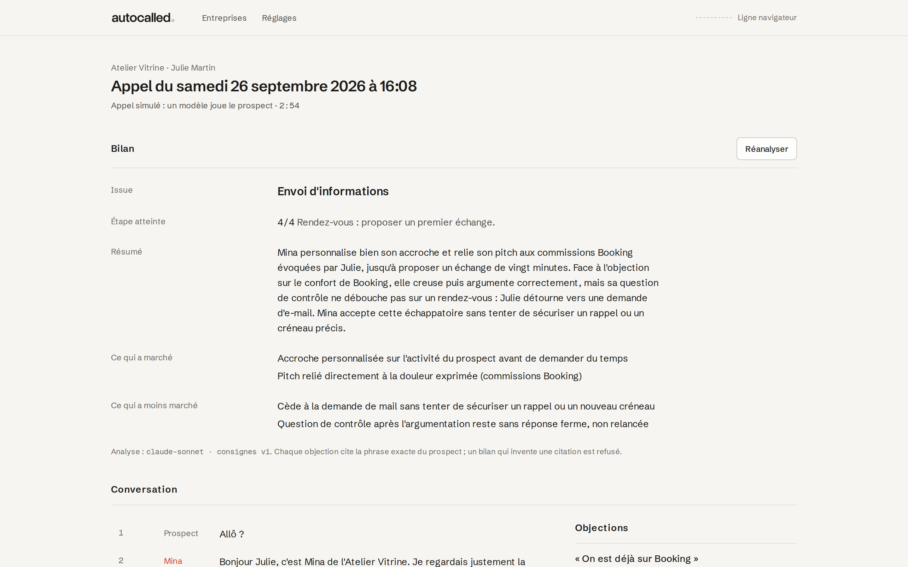
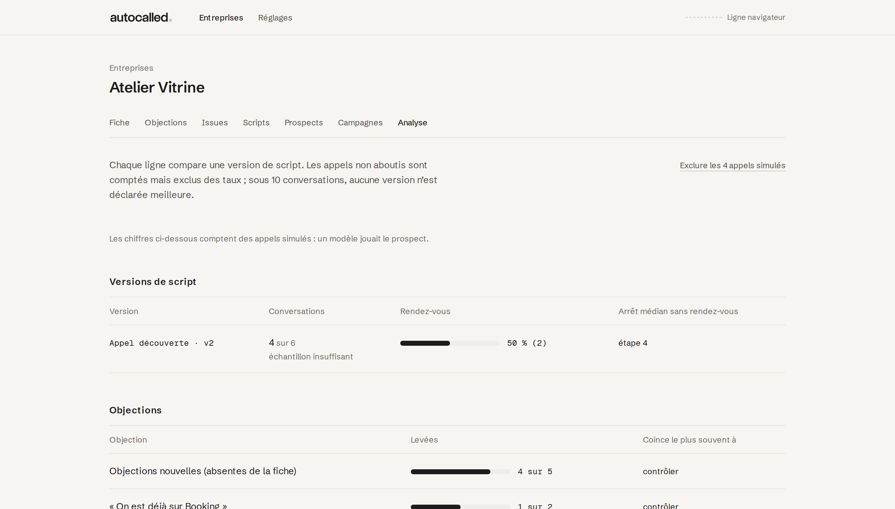
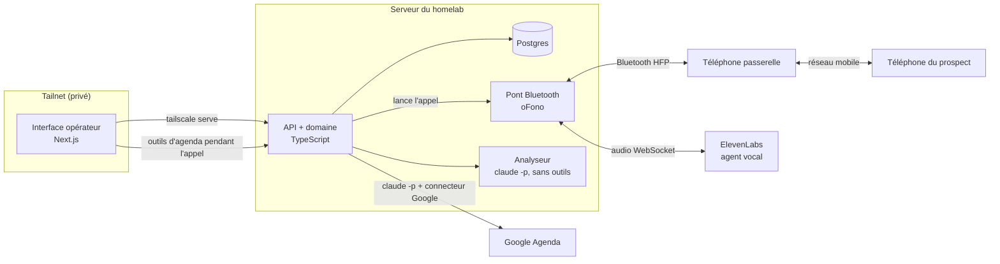

<h1>
  <picture>
    <source media="(prefers-color-scheme: dark)" srcset="docs/logo/autocalled-sombre.svg">
    
  </picture>
</h1>

Une assistante vocale IA qui passe de vrais appels de prospection sur un vrai réseau mobile, propose des créneaux lus dans Google Agenda, réserve le rendez-vous, puis rédige le bilan de chaque appel.

> **Statut : utilisable.** On parle à Mina depuis le navigateur ou on la fait appeler de vrais numéros autorisés par le téléphone passerelle ; les appels sont enregistrés, analysés et comparés. Sur la ligne téléphone, l'appel depuis une fiche, l'écoute, l'agenda et le bilan sont validés sur de vrais appels ; la campagne et la prise de main restent à valider.



<table>
  <tr>
    <td></td>
    <td></td>
  </tr>
</table>

<sub>Données fictives : entreprise et prospects inventés, numéros de la tranche que l'ARCEP réserve à la fiction.</sub>

## Le parcours d'un appel

1. L'opérateur choisit une **entreprise** à représenter, un **prospect** et une **version de script**.
2. Le serveur vérifie que le numéro du prospect est un **numéro autorisé**, puis fait composer l'appel à un **téléphone passerelle** appairé en Bluetooth.
3. **L'assistante** (Mina par défaut, nom réglable ; un agent ElevenLabs, voix « Stella »), suit le script, répond aux objections de l'entreprise et s'appuie sur l'historique des appels précédents avec ce prospect. Elle parle comme une humaine, avec des réactions et des hésitations.
4. Si le prospect est intéressé, elle propose deux ou trois créneaux libres et réserve le **rendez-vous** dans un calendrier dédié.
5. À la fin de l'appel, l'audio et la transcription sont rapatriés, et un **bilan** est produit : issue, étape atteinte, objections levées ou non (chacune justifiée par une citation), points forts et points faibles.
6. L'écran d'analyse compare les versions de script d'une même entreprise, sans désigner de gagnant tant que l'échantillon est trop petit.

## Ce que fait l'interface

- **Accueil** : l'appel en cours dans la bande d'appel (réplique du prospect, phrase de l'assistante en sous-titre, onde des deux voix sur la ligne téléphone, étape du script où elle se trouve, `E Écouter`, `Espace Prendre la main`, `Raccrocher`), la frise de la journée, les rappels datés du jour et ceux en retard.
- **Appels** : liste filtrée, comptée et paginée en base (issue, ligne, entreprise, version de script, période, rappels à faire, recherche dans les transcriptions) ; page d'un appel avec son bilan, chaque objection reliée à la phrase du prospect, et l'enregistrement synchronisé.
- **Entreprises** : fiche (offre, cible, arguments, interlocuteur, règles de rendez-vous) et aperçu de ce que l'assistante recevra, objections CRAC dans l'ordre où elle les reçoit, issues personnalisées, scripts versionnés, renommés ou archivés, analyse des versions sans gagnant désigné sous le seuil d'échantillon.
- **Prospects** : import de fiches Markdown sous consentement, état d'autorisation de chaque numéro, révocation, appel depuis la fiche (ligne navigateur, simulation ou téléphone), prochain rappel.
- **Campagnes** : une file modifiable pendant la campagne (`S Sauter`, `Retirer`, `A Ajouter des prospects`, `Terminer la campagne`), `P Suspendre` et reprise, pause entre deux appels, bilan de la campagne.
- **Téléphone** : état du téléphone passerelle, appairage depuis l'interface, garde-fous (appels par heure et par jour, pause entre deux appels).
- **Réglages** : l'assistante (nom, premier message, dernière configuration poussée) en lecture, l'agenda, les rendez-vous à inscrire, le journal de Claude Code.
- **Partout** : la barre du haut dit l'état de la ligne, le plafond atteint et l'heure du prochain appel possible, le chrono de l'appel et la campagne ouverte ; chaque action a sa touche (`?` ouvre la liste des raccourcis) ; une fiche modifiée par Claude Code pendant qu'on l'éditait est signalée au lieu d'être écrasée (ADR 0012).

## Architecture


```mermaid
flowchart LR
    subgraph Tailnet["Tailnet (privé)"]
        UI["Interface opérateur<br/>Next.js"]
    end

    subgraph Serveur["Serveur du homelab"]
        API["API + domaine<br/>TypeScript"]
        DB[("Postgres")]
        Bridge["Pont Bluetooth<br/>oFono"]
        Analyseur["Analyseur<br/>claude -p, sans outils"]
    end

    Phone["Téléphone passerelle"]
    Prospect["Téléphone du prospect"]
    EL["ElevenLabs<br/>agent vocal"]
    GCal["Google Agenda"]

    UI -->|tailscale serve| API
    API --> DB
    API -->|lance l'appel| Bridge
    Bridge <-->|Bluetooth HFP| Phone
    Phone <-->|réseau mobile| Prospect
    Bridge <-->|audio WebSocket| EL
    UI -->|outils d'agenda pendant l'appel| API
    API -->|claude -p + connecteur Google| GCal
    API --> Analyseur
```

## Décisions

Chaque choix qui surprendrait un lecteur est expliqué dans un ADR :

| ADR | Décision |
|---|---|
| [0001](docs/adr/0001-demo-fermee-numeros-autorises.md) | Démo fermée : l'assistante n'appelle que des numéros autorisés, informés au préalable |
| [0002](docs/adr/0002-agenda-par-outils-webhook-maison.md) | Agenda par outils webhook maison plutôt que l'intégration Cal.com |
| [0003](docs/adr/0003-ligne-bluetooth-via-telephone-passerelle.md) | Première ligne : un téléphone passerelle en Bluetooth plutôt que Twilio |
| [0004](docs/adr/0004-heberge-sur-le-homelab.md) | Hébergé sur le homelab, pas dans le cloud |
| [0005](docs/adr/0005-bilan-par-claude-code-en-mode-headless.md) | Bilan produit par Claude Code en mode headless |
| [0006](docs/adr/0006-authentification-par-identite-tailscale.md) | Authentification par l'identité Tailscale |
| [0007](docs/adr/0007-pont-bluetooth-service-pilote-par-le-web.md) | Le pont Bluetooth est un service permanent, piloté par l'application |
| [0008](docs/adr/0008-prise-de-main-par-websocket-direct.md) | Prendre la main : la voix de l'opérateur passe par un WebSocket direct vers le pont |
| [0009](docs/adr/0009-serveur-mcp-local-sous-confirmation.md) | Piloter Autocalled depuis Claude Code : un serveur MCP local en stdio, sous confirmation de l'opérateur |
| [0010](docs/adr/0010-configuration-de-l-assistante-par-le-mcp.md) | La configuration de l'assistante se règle aussi depuis Claude Code : deux régimes, une poussée sous confirmation |
| [0011](docs/adr/0011-rappel-date-par-l-analyse.md) | Un rappel convenu est daté par l'analyse, et fait dès le prochain appel |
| [0012](docs/adr/0012-ecritures-concurrentes-comparees-a-ce-qui-a-ete-lu.md) | Écritures concurrentes : chacun compare à ce qu'il a lu, personne ne verrouille |

La personnalité de l'assistante est du code : son prompt ([agent/prompt.md](agent/prompt.md)) et sa configuration sont versionnés ici, et `pnpm agent pull` / `pnpm agent push` les synchronisent avec ElevenLabs sans jamais écraser une modification distante non rapatriée ; `push` montre la différence et demande confirmation. Le serveur MCP peut aussi les modifier puis les pousser, après ton accord sur la différence (ADR 0010). Son nom (Mina par défaut) et son premier message vivent en base et valent dès l'appel suivant.

Le vocabulaire du domaine (entreprise, prospect, script, objection, issue, bilan…) est défini dans [CONTEXT.md](CONTEXT.md). Le code utilise ces mots-là et pas d'autres.

## Feuille de route

Chaque étape se termine sur quelque chose qui marche de bout en bout ; le plus risqué passe en premier.

- [x] **0. Spike Bluetooth** : le serveur fait composer le téléphone passerelle, le son passe dans les deux sens, le raccrochage est détecté.
- [x] **1. Premier appel de Mina** : une commande lance un appel ; configuration de l'agent versionnée ; latence mesurée.
- [x] **2. Cœur du domaine en TDD** : consentements et numéros autorisés, fiches prospect, cycle de vie d'une campagne, calcul des créneaux.
- [x] **3. Squelette web** : Postgres, authentification Tailscale, entreprises (fiche, objections CRAC, issues, scripts versionnés), import des fiches prospect avec consentement. Le bouton d'appel attend la ligne.
- [x] **Ligne navigateur et appels simulés** : conversations réelles avec Mina depuis le navigateur, et appels où un modèle joue le prospect (signalés comme tels).
- [x] **4. Bilan** : audio et transcription rapatriés, analyse, écran d'un appel avec audio synchronisé.
- [x] **5. Agenda** : disponibilités lues par le connecteur Google Agenda de Claude et gardées en copie, créneaux proposés et réservés pendant l'appel par des outils exécutés côté client, événement créé juste après.
- [x] **6. Campagne en direct** : enchaînement des appels, transcription en temps réel.
- [x] **7. Scripts versionnés et analyse** : comparaison des versions, avec garde sur la taille de l'échantillon.
- [ ] **8. Ligne téléphone dans l'application** : appel depuis une fiche ou une campagne, suivi et écoute en direct, prise de main, agenda réel, bilan, appairage depuis l'interface. Appels, écoute, agenda et bilan validés sur de vrais appels ; campagne et prise de main à valider.
- [x] **9. Pilotage par Claude Code** : serveur MCP qui lit et écrit tout le produit, assistante comprise, sous confirmation de l'opérateur, et skill de projet.
- [x] **10. File de campagne et rappels datés** : la file se modifie pendant la campagne, les rappels convenus sont datés et listés à l'accueil.

## Lancer le projet

Prérequis : Node 24, pnpm, Docker, Tailscale, et Claude Code connecté (il produit les bilans et lit l'agenda). Le service `autocalled-web` suppose le dépôt dans `~/projects/autocalled` (chemin écrit dans `deploy/systemd/autocalled-web.service`).

```bash
pnpm install
cp .env.example .env && chmod 600 .env   # puis remplir les valeurs
claude setup-token             # jeton longue durée à copier dans CLAUDE_CODE_OAUTH_TOKEN
docker compose up -d           # Postgres, sur 127.0.0.1 seulement
pnpm --filter @autocalled/web db:migrate
pnpm agent create              # crée Mina chez ElevenLabs, à faire une fois
scripts/installer-services.sh  # construit et lance l'interface (service systemd utilisateur)
sudo tailscale serve --bg --https=8449 http://127.0.0.1:3020
```

`ORIGINE_APP` doit être l'adresse exacte servie par `tailscale serve` : l'application refuse tout autre nom d'hôte, et la prise de main toute autre origine.

### Mettre à jour

L'ordre compte, parce que le prompt de l'assistante attend des variables que l'application et le pont envoient :

1. `pnpm install`, puis `pnpm --filter @autocalled/web db:migrate` (relire d'abord une migration qui ajoute un texte de consentement).
2. `scripts/installer-services.sh`, qui reconstruit et relance l'interface.
3. Si `apps/pont` a changé : `scripts/installer-pont.sh`, qui ne relance pas le pont pendant un appel.
4. Seulement ensuite, si `agent/` a changé : `pnpm agent push`, qui montre la différence et demande confirmation, puis `pnpm agent status`. Poussé plus tôt, un prompt qui cite une variable que l'application n'envoie pas encore empêche ElevenLabs d'ouvrir la conversation.

### Ligne téléphonique (facultative)

Sans elle, Mina se teste par la ligne navigateur. Pour qu'elle appelle de vrais numéros, il faut du matériel : un serveur Linux, une clé Bluetooth reconnue par le noyau (la TP-Link UB500 l'est depuis Linux 5.16) et un téléphone avec sa carte SIM, posé à côté du serveur. Un téléphone dédié est préférable : tant qu'il est connecté, le serveur voit ses appels.

```bash
scripts/installer-pont.sh      # BlueZ, oFono, libsbc, environnement Python, règle D-Bus, secret, chemin /prise-en-main, service autocalled-pont
                               # (PORT_HTTPS=… devant la commande si l'interface n'est pas servie sur 8449)
scripts/installer-services.sh  # relance l'interface, qui lit le secret du pont au démarrage
```

Puis, dans l'interface, page **Téléphone** : saisir l'adresse Bluetooth du téléphone, ouvrir l'appairage, comparer le code, accepter sur le téléphone. Sur chaque fiche prospect, la ligne « Téléphone » fait appeler le vrai numéro, et les campagnes peuvent la choisir. Pendant l'appel, on suit la conversation, on l'écoute, et on peut prendre la main : Mina se tait et l'opérateur parle au prospect depuis son navigateur (casque recommandé). Si PipeWire tourne sur le serveur, son module mains-libres doit laisser le profil à oFono (le script prévient). Le fonctionnement et ses limites sont dans les [ADR 0003](docs/adr/0003-ligne-bluetooth-via-telephone-passerelle.md) et [0007](docs/adr/0007-pont-bluetooth-service-pilote-par-le-web.md).

L'agenda passe par le connecteur Google Agenda de Claude : rien à configurer si Claude Code y a accès. L'API Google directe est facultative (client OAuth « application Web », redirection vers `ORIGINE_APP/google/retour`).

Tests : `pnpm test`, `pnpm typecheck`. Les tests de l'application et du serveur MCP tournent sur une base `autocalled_test` du même Postgres, migrée et vidée par les tests eux-mêmes ; elle se crée une fois : `docker compose exec postgres createdb -U autocalled autocalled_test`. Aucun test n'appelle ElevenLabs ni `claude -p`, et le pont y est remplacé par un faux.

## Piloter Autocalled depuis Claude Code

Ouvert dans ce dépôt, sur le serveur, Claude Code trouve le serveur MCP d'Autocalled dans `.mcp.json` et propose de l'activer au démarrage. Ses 59 outils lisent et écrivent tout Autocalled, dans le vocabulaire de [CONTEXT.md](CONTEXT.md) : l'assistante (nom, premier message, prompt, voix et réglages, historique de ses configurations), les entreprises et leur fiche, les objections et issues, les scripts et leurs versions, les prospects (import, correction, suppression d'une fiche, consentements), les campagnes et leur file, les appels et leurs bilans, l'analyse des versions, l'agenda, la ligne et le journal. La skill de projet [.claude/skills/autocalled](.claude/skills/autocalled/SKILL.md), versionnée avec le dépôt, lui apprend les parcours (préparer une entreprise, versionner un script, importer des prospects, piloter une campagne, relire les bilans et ajuster, régler l'assistante) et les règles ; sa [référence](.claude/skills/autocalled/REFERENCE.md) liste chaque outil avec ses entrées. Autocalled ne propose jamais rien de lui-même : les ajustements de script ou de prompt se décident dans la conversation, puis passent par le MCP ou à la main.

Ce qui fait sonner le téléphone, révoque un numéro, supprime une fiche ou une entreprise, envoie une invitation à un prospect, desserre les plafonds de la ligne, change le nom ou le premier message de l'assistante, change le nom de l'entreprise, ajoute des prospects à une campagne téléphone en cours, change pendant une telle campagne ce que l'assistante dira au prospect (fiche de l'entreprise, objections, fiche d'un prospect en file), ou pousse sa configuration vers ElevenLabs attend ton accord : Claude Code affiche une question rédigée par le serveur (qui, quel numéro, quel script, quelle heure, quelle différence), et le modèle ne peut pas y répondre à ta place. En mode non interactif (`claude -p`), ces gestes sont refusés. Chaque appel d'outil est noté dans Réglages, « Journal de Claude Code ». Le prompt se modifie dans `agent/` par remplacements exacts : rien ne change pour les appels avant la poussée, et `agent/` modifié reste à relire (`git diff agent/`) et à commiter, le serveur ne lançant jamais git. Le détail et les raisons sont dans les ADR [0009](docs/adr/0009-serveur-mcp-local-sous-confirmation.md) et [0010](docs/adr/0010-configuration-de-l-assistante-par-le-mcp.md).

Pour ne plus être interrogé par Claude Code sur les lectures, ses 21 outils de lecture (`lire_assistante`, `historique_assistante`, `lister_entreprises`, `lire_entreprise`, `lire_version_script`, `lister_prospects`, `lire_prospect`, `lire_texte_consentement`, `lire_consentements`, `lister_appels`, `lire_appel`, `analyser_versions`, `rappels_du_jour`, `lire_journee`, `apercu_variables_appel`, `lister_campagnes`, `lire_campagne`, `etat_ligne`, `etat_agenda`, `lister_rendez_vous`, `lire_journal_mcp`) peuvent aller dans la liste `allow` de tes réglages, préfixés `mcp__autocalled__`. `lire_assistante` lit aussi ElevenLabs, sans rien y écrire.

## Sécurité

- **Accès** : l'interface n'écoute que sur 127.0.0.1 et n'est servie que sur le tailnet par `tailscale serve` ; chaque requête doit porter l'identité Tailscale de l'opérateur. Seul l'hôte de `ORIGINE_APP` est servi (une page qui se fait résoudre vers 127.0.0.1 est refusée), et aucune page ne se laisse encadrer (`frame-ancestors 'none'`, `X-Frame-Options`). Pas de mot de passe ni de session : [ADR 0006](docs/adr/0006-authentification-par-identite-tailscale.md).
- **Pont** : il n'écoute que sur 127.0.0.1 et partage un secret avec l'application dans les deux sens ; ses routes (`/api/pont/…`) répondent 404 à toute requête relayée. La prise de main vérifie l'identité et l'origine. Il ne compose qu'un numéro au format international, et chaque composition passe par les plafonds.
- **Numéros** : le serveur vérifie le numéro autorisé avant chaque appel, y compris à chaque tour d'une campagne ; un numéro révoqué ne se réautorise pas.
- **Textes de tiers** : une transcription est la parole d'un tiers. L'analyseur (`claude -p`) tourne sans outils, sans réglages ni mémoire, dans un dossier vide propre à l'appel ; le serveur MCP rend transcriptions, citations et fiches dans des blocs balisés comme données non fiables.
- **Claude Code** : les gestes qui engagent (voir plus haut) attendent une question que seul l'opérateur peut accepter, liée à une empreinte signée à usage unique ; ils sont refusés en mode non interactif ; chaque appel d'outil est journalisé, et une erreur interne ne renvoie pas son détail au modèle.
- **Fichiers** : `.env` en 600, services systemd utilisateur sans élévation de privilèges et en `UMask=0077`, enregistrements en 0600, journal du pont sans parole ni adresse du prospect.
- **Risques acceptés** : un processus du compte de l'opérateur peut se faire passer pour lui sur 127.0.0.1 (il lit de toute façon le `.env`) ; l'effacement complet d'une personne (appels, enregistrements, copies chez ElevenLabs) n'est pas encore un geste du produit ([améliorations futures](docs/future-improvements.md)).

## Cadre légal

Autocalled est une démo fermée : Mina n'appelle que des personnes qui ont accepté, au préalable, d'être appelées par une IA et enregistrées. C'est pour cela qu'elle ne s'annonce pas comme IA pendant l'appel. Pour démarcher de vrais prospects, ce ne serait pas permis en l'état : l'AI Act (art. 50, en vigueur depuis le 2 août 2026) impose d'informer la personne qu'elle parle à une IA, le droit français impose de la prévenir de l'enregistrement, et depuis le 11 août 2026 le démarchage téléphonique des particuliers exige leur consentement préalable. Le détail est dans l'[ADR 0001](docs/adr/0001-demo-fermee-numeros-autorises.md).

## Ce que ce dépôt ne contient pas

Aucun secret, aucun numéro de téléphone réel, aucun enregistrement ni aucune transcription d'appel. La configuration passe par des variables d'environnement, documentées dans un `.env.example` sans valeurs.
